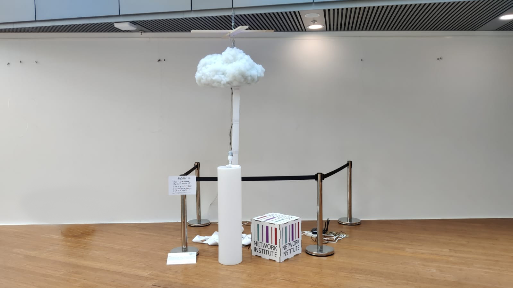
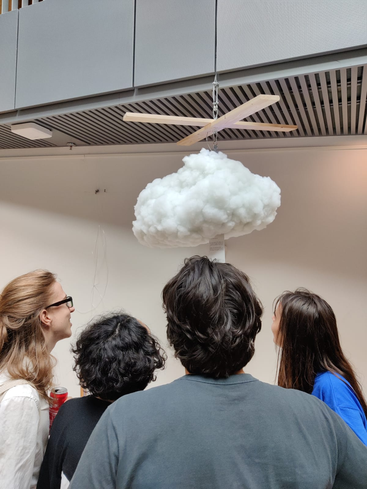
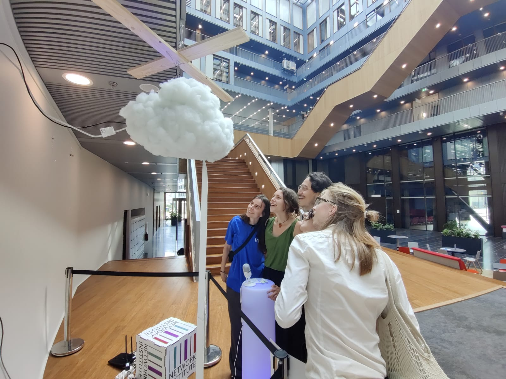
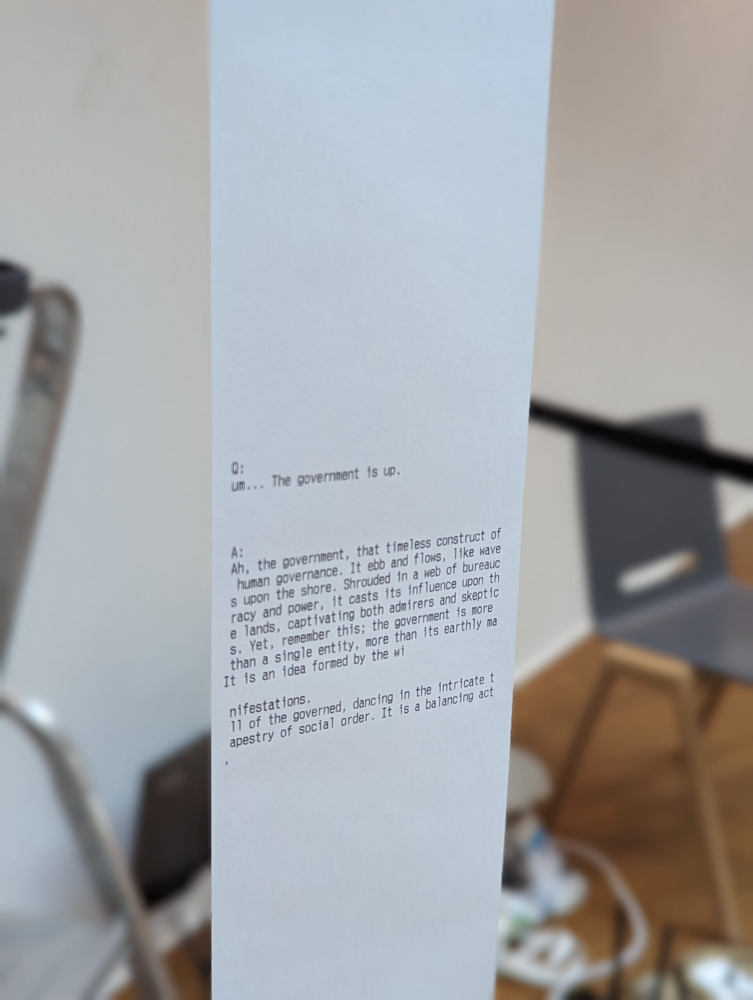

# append-us-apart
A non-humanoid embodied AI-installation where a user can interact with an LLM through voice prompting and getting their answers on paper as to show the effects of LLM-output on the physical world

## Context
30 November 2022 OpenAI’s ChatGPT was released. This iteration of their longstanding research into transformer-based Language Models caused a massive democratization of access to large language models: The only thing necessary to interact with the network was an internet connection. The new release caused an explosion of usage and the web-app was deemed fastest growing app in history. Society is instantaneously confronted with multi-dimensional dilemmas. On a practical level for example: Should one adopt or neglect the usage of ChatGPT in specific domains? If adopted: How should we responsibly adopt? How to deal with inaccuracy of output and non-factual output What are the legal implications of using its output? Who is responsible for the output of the model? and many more such questions arose and still arise.
In the media and in academia, heavy discussion around more fundamental concepts in AI, human psychology and around what ChatGPT is and is not, started to gain traction. A vivid example of this is the discussion around the concept of the “Stochastic Parrot”, where Sam Altman (CEO of OpenAI) got involved himself via the tweet “I am a stochastic parrot and so r u” which seems diametrically opposite to the view of linguist Emily M. Bender.
Prominent public figures signed an open letter urging ”all AI labs” to pause Giant AI experiments, which caused strong reactions. For example some researchers are proposing the idea that we should cut the hype and fear for AI models in the light of imaginary future threats and focus on more realistic harms happening today. As we see, Large Language Models and more specifically ChatGPT, have caused a lot of commotion in academia as well as in general society, as we are figuring out what it is, what it is not and how we want to deal with this development: A cause for unrest and joy. How should we proceed with this technology as a society?

## The Installation
The use of Large Language Models has exploded since OpenAI provided access to their ‘ChatGPT’ model. This created a big wave of glorification of the model, but also criticism: makers were not transparent enough about the development process, the environmental impact is vast, users could attribute human features to the output and some questions about moral and legal implications remain unanswered. In ‘Append Us Apart.’, the visitor is asked to handle text generators in a different context and form than from their private devices. The visitors make a (displaced) collective effort into creating a physical, permanent form of their Questions and Answers. Should you leave your piece as part of this collaborative effort? Do you see yourself reflected in the output? How does it make you feel?

## Authors
The work is created by [Daan Wijnhorst](https://www.linkedin.com/in/daan-wijnhorst-84919b18b/) (Computer Science) and funded by the VU Network Institute.

## Sources
Cloud structure: Charisse Eaves, [https://www.youtube.com/watch?v=nlf-XaPj2nY&ab_channel=CharisseEaves](https://www.youtube.com/watch?v=nlf-XaPj2nY&ab_channel=CharisseEaves)

## Photos

